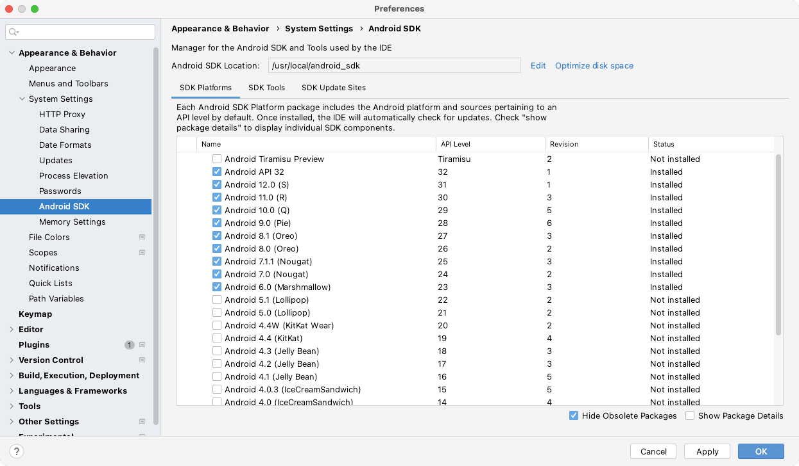
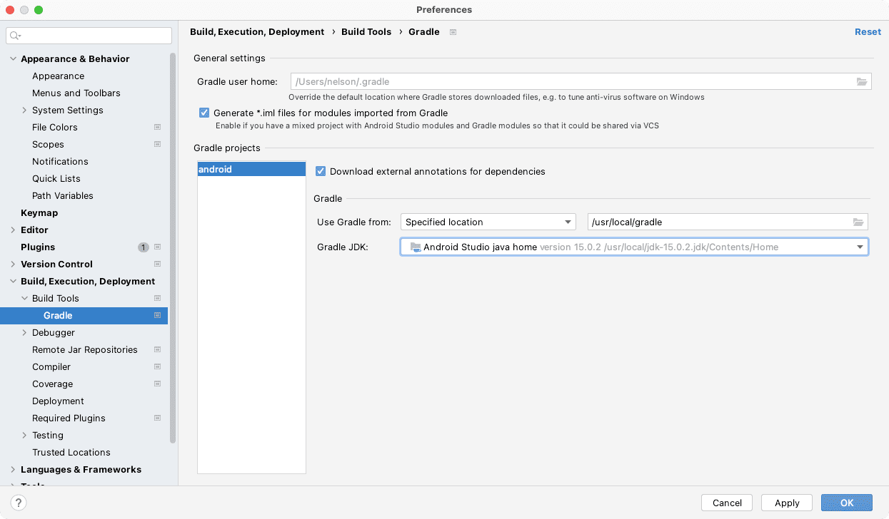

# Instalación de dependencias para Ionic + Cordova en macOS

<dl>
  <dt>Fecha de prueba</dt>
  <dd>abril de 2022</dd>
  <dt>Plataforma</dt>
  <dd>macOS Monterrey 12.3.1</dd>
</dl>

## Requerimientos

- git
- Node JS
- Java SDK 15
- Android command line tools
- Gradle 7
- Android Studio (optional)

## Directorio de instalaciones

Para centralizar y administrar las instalaciones posteriormente vamos a instalar todo en un directorio accesible para todos los usuarios de la máquina. Yo prefiero utilizar `/usr/local`.

```sh
sudo chown `whoami` /usr/local
```

Si no tienes permisos administrativos puedes instalar todo en una carpeta cualquiera que puedas modificar. Para efectos de este tutorial supondremos que todo se instalaría en `/usr/local`.

## GIT

Este comando se puede conseguir instalando **Command line tools** de XCode.

```sh
xcode-select --install
```

## Node JS

Aunque la siguiente opción parece ser más complicada que usar el paquete instalador, permitirá a largo plazo mantener un directorio global controlado. Puedes obtener el enlace actualizado para tu arquitectura y sistema operativo en [la web de NodeJS](https://nodejs.org/en/download/current/).

```
cd /usr/local
curl -o ~/Downloads/nodejs.tar.gz https://nodejs.org/dist/v17.9.0/node-v17.9.0-darwin-x64.tar.gz
tar xf ~/Downloads/nodejs.tar.gz
mv node-v17.9.0-darwin-x64 nodejs
rm -f node-v17.9.0-darwin-x64.tar.gz
PATH=/usr/local/nodejs/bin:${PATH}
npm -g update npm@latest
```

## Java SDK 15

Puede visitar [el directorio de Oracle](https://www.oracle.com/java/technologies/javase/jdk15-archive-downloads.html) para obtener el JDK de Java 15. Supongamos que se ha descargado en el directorio de descargas de tu cuenta.

```sh
cd /usr/local
tar zxf ~/Downloads/jdk-15.0.2_osx-x64_bin.tar.gz
JAVA_SDK_ROOT=/usr/local/jdk-15.0.2.jdk/Contents/Home/
JAVA_HOME=${JAVA_SDK_ROOT}
PATH=${JAVA_SDK_ROOT}/bin:${PATH}
```

## Android command line tools

Visitando la [web de descargas de Android Studio](https://developer.android.com/studio#downloads) puede encontrar el enlace al instalador de `Command line tools only`. Supongamos que se ha descargado en el directorio de descargas de tu cuenta.

```sh
cd /usr/local
unzip -d /usr/local/android_sdk ~/Downloads/commandlinetools-mac-8092744_latest.zip
ANDROID_SDK_ROOT=/usr/local/android_sdk
ANDROID_HOME=${ANDROID_SDK_ROOT}
/usr/local/android_sdk/cmdline-tools/bin/sdkmanager --sdk_root=/usr/local/android_sdk "cmdline-tools;latest"
PATH=${ANDROID_SDK_ROOT}/emulator:${ANDROID_SDK_ROOT}/tools:${ANDROID_SDK_ROOT}/platform-tools:${ANDROID_SDK_ROOT}/cmdline-tools/latest/bin:${PATH}
```

Ahora puedes instalar las librerias y dependencias que necesites para Android. A continuación instalo solo algo arbitrario.

```sh
sdkmanager "build-tools;30.0.0" "build-tools;30.0.2" "build-tools;30.0.3" "build-tools;31.0.0" "build-tools;32.0.0" "build-tools;32.1.0-rc1" "build-tools;33.0.0-rc2" "cmake;3.18.1" "emulator" "patcher;v4" "platform-tools" "platforms;android-23" "platforms;android-24" "platforms;android-25" "platforms;android-26" "platforms;android-27" "platforms;android-28" "platforms;android-29" "platforms;android-30" "platforms;android-31" "platforms;android-32" "sources;android-23" "sources;android-24" "sources;android-25" "sources;android-26" "sources;android-27" "sources;android-28" "sources;android-29" "sources;android-30" "sources;android-31" "system-images;android-30;google_apis_playstore;x86"
```

Para probar que todo funciona perfecto puedes consultar el estado de los paquetes instalados.

```sh
sdkmanager --list_installed
```

Solo si te aparecen advertencias similares a esta…

```
Observed package id 'platform-tools' in inconsistent location '/usr/local/android_sdk/platform-tools-2'
```

… entonces puedes borrar el directorio original y mover la alternativa al nombre original. Por ejemplo a mi me aparecen `platforms-tools`, `platforms-tools-2`, `emulator` y `emulator-2` que corregí de la siguiente manera.

```sh
cd /usr/local/android_sdk
ls -l
# drwxr-xr-x  20 nelson  wheel   640B Apr 13 20:41 emulator
# drwxr-xr-x  20 nelson  wheel   640B Apr 13 20:41 emulator-2
# drwxr-xr-x  18 nelson  wheel   576B Apr 13 20:41 platform-tools
# drwxr-xr-x  18 nelson  wheel   576B Apr 13 20:42 platform-tools-2
rm -fr platform-tools
mv platform-tools-2 platform-tools
rm -fr emulator
mv emulator-2 emulator
```

Consulta nuevamente el estado de los paquetes instalados.

## Gradle 7

Instala la [última versión 7 de Gradle](https://gradle.org/releases/). Supongamos que se ha descargado en el directorio de descargas de tu cuenta.

```sh
cd /usr/local
unzip ~/Downloads/gradle-7.4.2-bin.zip
mv gradle-7.4.2/ gradle
GRADLE_HOME=/usr/local/gradle
CORDOVA_ANDROID_GRADLE_DISTRIBUTION_URL=https\\://services.gradle.org/distributions/gradle-7.4.2-bin.zip
PATH=${GRADLE_HOME}/bin:${PATH}
gradle -v
```

## Variables de ambiente

Ya que todo parece funcionar hasta ahora, solo nos queda instalar las variables de ambiente para que estas se carguen al iniciar una terminal. Para ello puedes especificarles en tu archivo de usuario, `~/.bashrc` o `~/.zshrc`, o globalmente, `/etc/bashrc` o `/etc/zshrc`. Personalmente prefiero hacerlo globalmente para que así las aplicaciones puedan acceder a estos archivos sin problemas. En cualquier caso dependerá de la shel que uses actualmente, la variable `$SHELL` indica la ruta actual de tu shell.

```sh
echo $SHELL
# /bin/bash
sudo nano /etc/bashrc
```

```sh
echo $SHELL
# /bin/zsh
sudo nano /etc/zshrc
```

En cualquier caso debes agregar las siguientes líneas tal como lo hemos hecho anteriormente.

```sh
export JAVA_HOME=/usr/local/jdk-15.0.2.jdk/Contents/Home
export JAVA_SDK_ROOT=${JAVA_HOME}

export ANDROID_SDK_ROOT=/usr/local/android_sdk
export ANDROID_HOME=${ANDROID_SDK_ROOT}

export GRADLE_HOME=/usr/local/gradle
export CORDOVA_ANDROID_GRADLE_DISTRIBUTION_URL=https\\://services.gradle.org/distributions/gradle-7.4.2-bin.zip

export PATH=${JAVA_SDK_ROOT}/bin:${ANDROID_SDK_ROOT}/emulator:${ANDROID_SDK_ROOT}/tools:${ANDROID_SDK_ROOT}/platform-tools:${ANDROID_SDK_ROOT}/cmdline-tools/latest/bin:/usr/local/nodejs/bin:${GRADLE_HOME}/bin:${PATH}
```

## Creando un projecto de ejemplo para Ionic y Cordova

```sh
npm install -g @ionic/cli
mkdir -p ~/Developer/
cd ~/Developer/
ionic start SampleApp tabs --cordova --type=angular --no-git
cd SampleApp
ionic cordova platform add android
ionic cordova build android
```

Si todo sale bien obtendremos un hermoso <span style="color:green">BUILD SUCCESSFUL</span>.

## Opcional: Configurando Android Studio

Si has descargado Android Studio puedes instalarle y usar las rutas conocidas para entregar durante la instalación.



Luego de instalar Android Studio, puedes generar el contenido necesario para este IDE ejecutando el siguiente comando.

```sh
cd ~/Developer/SampleApp/
ionic cordova prepare android
```

Y abriendo el proyecto generado en `~/Developer/SampleApp/platforms/android`. Luego recuerda especificar la versión de JAVA que utilizarás si cuentas con más de una instalación de Java SDK.


